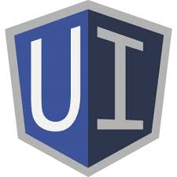

swks-genpoly
============

> [Sturdyworks](http://sturdyworks.org) [Yeoman](http://yeoman.io) [generator-ng-poly](https://github.com/dustinspecker/generator-ng-poly) Seed Project for AngularJS

Offers you a Yeoman generator to initiate a Web application with the following workflow:


<br><br><br><br>

## Purpose

The [generator](https://github.com/dustinspecker/generator-ng-poly) utilized in this project seed focuses on organizing Angular components by feature (home, about, video player, etc.) instead of by type (controller, service, directive, etc.) to encourage the development of self-contained, reusable components. A typical workflow with this generator consists of creating an Angular module ([ng-poly:module](#module)) and then generating controllers, directives, etc. for this module to create a new feature.





<br><br><br><br>

## Why swks-poly ?

The code generated by [generator-ng-poly](https://github.com/dustinspecker/generator-ng-poly) is terrific and even allows [Controller As](http://toddmotto.com/digging-into-angulars-controller-as-syntax/) Syntax, but as with all [generators](https://docs.google.com/spreadsheets/d/1r8rJy2Q5p5QORYKcye93UECwOlSgFL24c5fyF7dqhaM/edit#gid=1607194899) much code related to cross-browser support is missing, and since this project seed focuses on [Bootstrap 3.3](http://getbootstrap.com/getting-started/) and [Angular UI]() several code enhancements can be made to optimize rendering webpages on Windows 8.1, Android, etc.

- [ ] [Bootstrap 3.3 Browser and Device Support](http://getbootstrap.com/getting-started/#support)
- [ ] [AngularJS 1.2.x Internet Explorer Compatibility](https://docs.angularjs.org/guide/ie)
- [ ] [ngBook AngularJS and Internet Explorer](https://www.ng-book.com/p/AngularJS-and-Internet-Explorer/)
- [x] [Testing on Internet Explorer 8+](https://www.modern.ie/en-us/virtualization-tools#downloads)
- [ ] [Google Web Starter Kit](https://github.com/google/web-starter-kit/releases/tag/v0.5.0)
- [ ] [Google Web Fundamentals - Multi-Device Layouts](https://developers.google.com/web/fundamentals/layouts/)
- [ ] [Google Web Fundamentals - Device Access & Integration, among others...](https://developers.google.com/web/fundamentals/device-access/stickyness/)

**All of the features above should be completed by the end of 2014**

## Options Used to Create Repository

```
brad@computer:~/devel/src/swks-genpoly$ yo ng-poly

     _-----_
    |       |    .--------------------------.
    |--(o)--|    |    Welcome to ngPoly!    |
   `---------´   '--------------------------'
    ( _´U`_ )    
    /___A___\    
     |  ~  |     
   __'.___.'__   
 ´   `  |° ´ Y ` 

? What is the app's name? swks-genpoly
? Which version of Angular should be used? 1.2.*
? What host should the app run on? localhost
? Which port should the app run on? 3000
? Which folder should the app be developed in? app
? Which is the preferred markup language? HTML
? Which is the preferred application scripting language? JavaScript
? Want to use Controller As syntax? Yes
? By default, should the route generator create controllers? Yes
? Should functions be defined and passed instead of defined inline (in callbacks)? Yes
? Want to use named functions instead of anonymous? Yes
? Where should unit tests be saved? app
? Which is the preferred test scripting language? JavaScript
? Which is the preferred unit testing framework? Jasmine
? Which is the preferred e2e testing framework? Jasmine
? Which is the preferred style language? LESS
? Should Polymer support be enabled? No
? Should a framework be setup? Bootstrap with UI Bootstrap
? Should ngRoute be used instead of UI Router? No
? Which additonal Bower components should be installed? 
 ◉ Angular Animate
 ◉ Angular Cookies
 ◉ Angular Resource
 ◉ Angular Sanitize
 ◉ Angular Touch
 ◉ Font Awesome
 ◉ Lo-Dash
❯◉ Restangular (installs Lo-Dash)
```

## Setup
1. Install [Node.js](http://nodejs.org/)
 - This will also install npm.
1. Run `npm install -g bower gulp yo generator-ng-poly`
 - This enables Bower, Gulp, and Yeoman generators to be used from command line.
1. Run `npm install` to install this project's dependencies
1. Run `bower install` to install client-side dependencies
1. Use [generator-ng-poly](https://github.com/dustinspecker/generator-ng-poly) to create additional components

## Gulp tasks
- Run `gulp build` to compile assets
- Run `gulp dev` to run the build task and setup the development environment
- Run `gulp unitTest` to run unit tests via Karma and to create code coverage reports
- Run `gulp webdriverUpdate` to download Selenium server standalone and Chrome driver for e2e testing
- Run `gulp e2eTest` to run e2e tests via Protractor
 - **A localhost must be running** - `gulp dev`

